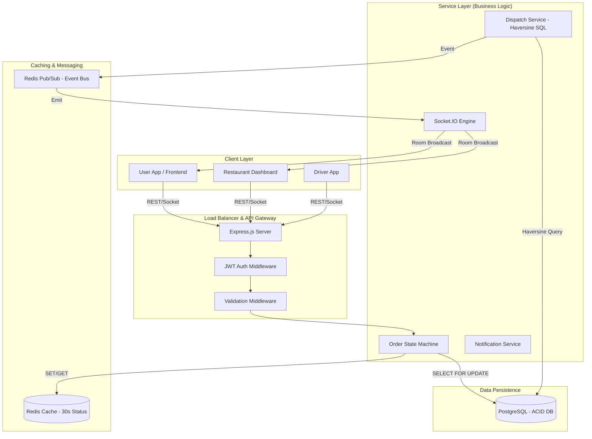

# System Architecture Design: Food Delivery Dispatch System

This document outlines the high-level system architecture and data flow of the Food Delivery backend.

## 1. High-Level Architecture Diagram

---

## 2. Component Breakdown

### 2.1 API & Application Layer (Node.js/Express)
*   **Routing**: Segregated routes for Orders, Drivers, Restaurants, and Notifications.
*   **Middleware**: 
    *   **Auth**: Ensures requests are from verified users.
    *   **Validation**: Sanitizes input and enforces technical constraints.
    *   **Error Handler**: Centralized catch-all for system-wide exceptions.

### 2.2 Intelligence & Dispatch Service
*   **Proximity Engine**: Unlike traditional app-side math, the system executes **raw SQL Haversine queries** to find the closest driver based on latitude/longitude coordinates.
*   **Atomic Assignment**: Prevents "Double Dispatch" by using database transactions. When an order is assigned, the driver row is locked until the transaction completes.

### 2.3 Real-time Data Flow (Socket.IO)
*   **Room Strategy**:
    *   `user:<user_id>`: Private channel for individual notifications.
    *   `order:<order_id>`: Shared channel for the "Active Delivery" view, syncing customer and driver.
    *   `restaurant:<rest_id>`: Real-time order ticker for kitchen staff.

### 2.4 Caching Layer (Redis)
*   **State Caching**: Status queries (e.g., "Is my food ready?") are served from Redis to protect the primary DB from high-frequency polling.
*   **Event Bus**: Redis Pub/Sub decouples order status changes from notification delivery, allowing the system to SCALE horizontally.

### 2.5 Relational Persistence (PostgreSQL)
*   **State Machine**: The `order_status` ENUM and transition logic act as the single source of truth for the system state.
*   **Relational Integrity**: Foreign key constraints ensure that an order cannot exist without a valid user or restaurant.

---

## 3. The "Order Placement" Sequence
1.  **User** sends `POST /api/orders`.
2.  **Server** validates items and creates a `status: placed` record in **Postgres**.
3.  **Redis** caches the order status for 30 seconds.
4.  **Restaurant** receives a Socket.IO event `NEW_ORDER`.
5.  **Restaurant** accepts; **Dispatch Service** queries **Postgres** for the nearest `available` driver.
6.  **Driver** status updated to `busy`; **User** notified via Socket.IO `DRIVER_ASSIGNED`.

---

## 4. Production Scaling (Load Balancing & Kafka)

To scale this system from a local project to millions of active users, the architecture evolves into a **Distributed Microservices** model:

### 4.1 Global Infrastructure Diagram

```mermaid
graph TD
    Client[Client Apps] --> LB[Load Balancer - Nginx/F5]
    
    subgraph "Auto-Scaling Group"
        LB --> S1[Node Server 1]
        LB --> S2[Node Server 2]
        LB --> S3[Node Server N...]
    end

    subgraph "Distributed Event Bus"
        S1 & S2 & S3 --> Kafka{Kafka Cluster}
        Kafka --> Analytics[Analytics Service]
        Kafka --> Fraud[Fraud Detection]
    end

    subgraph "Distributed Data Layer"
        S1 & S2 & S3 --> RedisCluster[(Redis Cluster - Pub/Sub & Cache)]
        S1 & S2 & S3 --> PG_Cluster[(Postgres Primary + Replicas)]
    end
```

### 4.2 Key Components in Production
1.  **Load Balancer**: Distributes incoming Traffic/Socket connections across multiple Node.js instances.
2.  **Redis Cluster**: Handles the "State Coordination." Since users and restaurants might be on different servers, Redis ensures Socket.IO messages travel across the entire cluster (Horizontal Scaling).
3.  **Kafka Cluster**: Used for **Order Streams**. Every status change is sent to Kafka for long-term storage, machine learning (ETA prediction), and fiscal auditing.
4.  **Database Replicas**: Multiple PostgreSQL "Read Replicas" are used so that `GET` requests (status checks) don't slow down `POST` requests (order creation).

---
